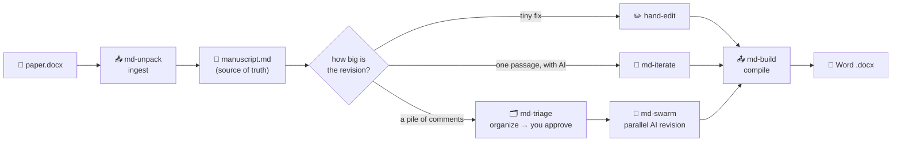
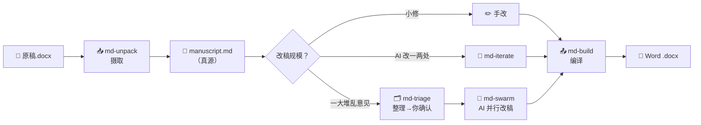

# md-paper

🌐 [**English**](#english) · [中文](#中文说明)

> **Revise your academic paper with AI — without breaking a single Zotero citation, figure, table, or cross-reference.** / **用 AI 改论文——不毁任何一个 Zotero 引用、图、表、交叉引用。**
> Ingest Word → edit a Markdown source of truth → compile back to Word with live citations. A suite of [Claude Code](https://www.claude.com/product/claude-code) skills for the *last mile* from an AI draft to a submission-ready `.docx`.

> ⚠️ **v0.1 — early public (beta) release.** Battle-tested on the author's real journal submissions, but new to other people's machines. Read [Known Limitations](#known-limitations) first. / **首个公开测试版**,请先读[已知限制](#已知限制)。

<a id="english"></a>
## English

### One picture

| Editing Word by hand | md-paper (Markdown source + AI + pandoc) |
|---|---|
| 😫 Revise every reviewer comment one by one | ✅ **Swarm**: drop the whole pile in, AI revises in batch |
| 😫 One Zotero *Refresh* wrecks your citations | ✅ **Live Zotero fields survive** — Refresh anytime |
| 😫 Figure/table numbers scramble after edits | ✅ **Auto-numbering + cross-references**, never wrong |
| 😫 Word formatting breaks; Ctrl+Z is your only hope | ✅ **Plain-text Markdown source** — git-versioned |
| 😫 You discover a lost citation three rounds too late | ✅ **Never-drop-a-citation hard gate** |
| 😫 Endless copy-paste between browser and Word | ✅ **Everything in the editor** — zero pasting |
| 😫 The result reeks of "AI writing" | ✅ **Seven de-AI rules** lower the machine-written signal |

### Why — the seven pain points it solves

Social-science authors (economics, management, sociology…) submit in **Word**, and the moment you paste AI output back, everything academic falls apart. md-paper fixes each:

1. **The web-AI copy-paste loop.** → *Dump comments in; AI applies them to the Markdown source; you only think at the approval gate.*
2. **Auto-revision tools are LaTeX-only, not Word.** → *Write Markdown, compile a perfectly formatted `.docx` with pandoc. No LaTeX.*
3. **Figures, tables, captions, notes, Zotero fields scramble the instant AI touches Word.** → *Output carries **live Zotero fields**, auto-numbered figures, cross-references that never break.*
4. **One comment at a time — no batch, no multi-agent.** → ***Swarm**: 30 comments → auto-organized → you approve once → parallel agents draft, a script lands them safely.*
5. **Vague comments take forever to execute.** → *Language rules turn "remove all first person" into a single swarm task.*
6. **Citations vanish silently mid-revision.** → *A hard gate **refuses** to drop a citation; a checker lists every dropped/split citation. Figures, tables, equations are watched the same way.*
7. **The revised paper reads like a machine wrote it.** → *Seven de-AI rules baked into the flow. Change only *how* it's said, never *what*.*

### Core features

🔗 Zotero-native live citation fields · 🖼️ figures/tables/captions/notes as plain text · 🔀 auto-numbered cross-references · 🐝 parallel swarm revision · 🛡️ never-drop-a-citation guard · 📝 git-diffable Markdown source · 🔄 de-AI humanizer · 🧮 OMML→LaTeX equations · 🧰 one shared toolchain · 🧩 built as composable Claude Code skills.

### Requirements

- **Windows + Microsoft Word** — ingest (`md-unpack`) reads Word citation fields/figures via COM. *(macOS not supported yet; everything after ingest is cross-platform.)*
- **Python 3** and **PowerShell** (Windows-native 5.1 is fine).
- **Zotero + the Zotero Word plugin** — to activate the live citations in your final `.docx` (press **Refresh** in Word). **Better BibTeX** is additionally required **only** for *live* mode and for **adding new references during revision** — it is **not** needed for the common flow *ingest an existing paper → revise → rebuild*.
- **A large-context AI model (recommended).** `md-swarm` reads your whole manuscript in each agent; for long papers a **200K+ (ideally 1M) context window** avoids truncation.
- **pandoc toolchain** — installed **automatically** by `setup_md_tools.ps1`, which downloads the **pinned** pandoc 3.9.0.2 + pandoc-crossref 0.3.24a from the official releases (the two versions must match — the installer handles it; **you download nothing**). Behind a slow/blocked network, pass `-Mirror https://<a-github-mirror>`.

### Install — let an AI do it

In any [Claude Code](https://www.claude.com/product/claude-code) session, clone the repo, then tell your AI:

```
git clone https://github.com/pwya/md-paper.git
```
> **"Read `INSTALL.md` in the md-paper folder and set up md-paper for me."**

The AI follows [INSTALL.md](INSTALL.md) — an executable runbook — to link the five skills into Claude Code, install the pandoc toolchain, and register the protection hooks. You don't type the commands yourself. Prefer manual? INSTALL.md lists every command.

### How to use

Five-stage pipeline. **Always start with `md-unpack`, finish with `md-build`;** the middle depends on how much you're changing.



1. **`md-unpack`** — *ingest.* Word `.docx` → `manuscript.md` (Markdown source of truth). **Run first.**
2. **`md-triage`** — *organize.* A pile of revision intents → a checklist you approve. *(Big revisions only.)*
3. **`md-swarm`** — *batch-revise.* Parallel AI agents apply the approved checklist, citation-safe. *(Big revisions only.)*
4. **`md-iterate`** — *polish one passage* with AI. *(Small edits.)*
5. **`md-build`** — *compile* back to Word. **Run last.**

**In one line:** `md-unpack` → (hand-edit · or `md-iterate` · or `md-triage` + `md-swarm`) → `md-build`.

> 📖 Full walkthrough, per-skill internals, command cheat-sheet, and a 30-comment worked example: **[User Guide](md-技能套件·用户完全手册.md)** (中文).

### Known Limitations

- **Windows + Microsoft Word only** — `md-unpack` drives Word via COM; macOS is not supported yet.
- *Other minor limitations (citation providers, page locators, escaping edge cases, floating figures, legacy AxMath equations) are not listed here — see the [User Guide](md-技能套件·用户完全手册.md).*

### License

Workflow code [Apache-2.0](LICENSE) © 2026 Yuang Panwang (潘王雨昂). Third-party: pandoc & pandoc-crossref (GPL-2.0) are *downloaded at setup*, not redistributed here; bundled Zotero/Lua filters are MIT — see [NOTICE](NOTICE).

---

<a id="中文说明"></a>
## 中文说明

[⬆ back to top / 回到顶部](#md-paper)

### 一图胜千言

| 传统改稿（手搓 Word） | md-paper（Markdown 真源 + AI + pandoc） |
| --- | --- |
| 😫 手动逐条改审稿意见 | ✅ **蜂群模式**:一堆意见扔进去,AI 批量改 |
| 😫 Zotero Refresh 一下引用全毁 | ✅ **不毁 Zotero 域**——出稿自带活引用域,Refresh 即用 |
| 😫 插图表后题注编号全乱 | ✅ **图表自动编号 + 交叉引用**,永远不错 |
| 😫 Word 格式崩了只能 Ctrl+Z | ✅ **Markdown 纯文本真源**,git 版本控制 |
| 😫 改到一半发现引用对不上 | ✅ **引用默认不删硬闸** |
| 😫 网页端复制粘贴到手软 | ✅ **全流程在编辑器内**,零粘贴 |
| 😫 改完一股 AI 味被审稿人识破 | ✅ **七条去 AI 味铁律** |

### 为什么——它解决的七大痛点

社科作者主流投稿格式是 **Word**,你一把 AI 结果粘回 Word,所有学术基础设施就崩了。md-paper 逐条解决:

1. **网页端"对话—复制—粘贴"死循环。** → *意见批量扔进去,AI 改到 Markdown 真源,你只在人工闸动一次脑。*
2. **自动改稿工具只支持 LaTeX、不支持 Word。** → *Markdown 写作 + pandoc 编译出格式完美 `.docx`,不学 LaTeX。*
3. **图/表/题注/注释/Zotero 域,AI 一改全乱。** → *出稿自带**活 Zotero 域**、图表自动编号、交叉引用永不断。*
4. **一次只能改一条,无法批量多 Agent。** → ***蜂群模式**:30 条意见 → 自动整理 → 你确认一次 → 并行起草、脚本安全落盘。*
5. **审稿意见太笼统,执行耗时。** → *"全文去第一人称"就是一个 swarm 任务。*
6. **改稿中引用静默丢失,发现时已晚。** → *引用默认不删**硬闸**;引用体检列出每一条被丢/被拆的引用。图表公式同样被盯着。*
7. **改完读起来像 AI 写的。** → *七条去 AI 味铁律内嵌在流程里。只改"怎么说",不改"说什么"。*

### 核心特性

🔗 兼容 Zotero 活引用域 · 🖼️ 图/表/题注/注释纯文本 · 🔀 交叉引用自动编号 · 🐝 并行蜂群改稿 · 🛡️ 引用默认不删 · 📝 可 git diff 的 Markdown 真源 · 🔄 去 AI 味 · 🧮 OMML→LaTeX 公式 · 🧰 全局工具链 · 🧩 Claude Code 技能形态、可组合。

### 环境要求

- **Windows + Microsoft Word** —— 摄取(`md-unpack`)靠 Word COM 读引用域/图。*(macOS 暂不支持;摄取之后全跨平台。)*
- **Python 3** + **PowerShell**(Windows 自带 5.1 即可)。
- **Zotero + Zotero 的 Word 插件** —— 用来在最终 `.docx` 里**激活活引用**(Word 里点 **Refresh**)。**Better BibTeX** 只在 *live* 模式和**改稿时新增文献**才**额外必需**——常规流(摄取已有稿 → 改 → rebuild)**不需要**它。
- **建议用大上下文 AI 模型。** `md-swarm` 每个 agent 都要读整篇稿子,长论文建议 **200K+(最好 1M)上下文窗口**,免得读不全被截断。
- **pandoc 工具链** —— 由 `setup_md_tools.ps1` **自动安装**:从官方发布页下载**锁定版** pandoc 3.9.0.2 + crossref 0.3.24a(两者必须配套,脚本自动搞定,**你什么都不用下载/上传**)。国内网络慢就加 `-Mirror https://<镜像>`。

### 安装——让 AI 替你装

在任意 [Claude Code](https://www.claude.com/product/claude-code) 会话里克隆本仓库,然后对 AI 说:

```
git clone https://github.com/pwya/md-paper.git
```
> **"读一下 md-paper 文件夹里的 `INSTALL.md`,帮我把 md-paper 装好。"**

AI 会照着 [INSTALL.md](INSTALL.md)(可执行操作手册)把五个技能接进 Claude Code、装工具链、注册保护钩子,**你不用敲命令**。想手动装,INSTALL.md 里也列了每条命令。

### 怎么用

五阶段流水线。**永远从 `md-unpack` 开始、`md-build` 结束**,中间看你改多大。



1. **`md-unpack`** —— *摄取。* Word `.docx` → `manuscript.md`(Markdown 真源)。**永远第一步。**
2. **`md-triage`** —— *整理。* 一堆修订意图 → 你审核确认的清单。*(仅大改。)*
3. **`md-swarm`** —— *批量改。* 多 AI agent 并行、引用安全地落地清单。*(仅大改。)*
4. **`md-iterate`** —— *润色单段*。*(小修。)*
5. **`md-build`** —— *出稿*,编回 Word。**永远最后一步。**

**一句话:** `md-unpack` → (手改 · 或 `md-iterate` · 或 `md-triage` + `md-swarm`) → `md-build`。

> 📖 完整演练、各技能内部流程、命令速查卡、30 条审稿意见实战:见**[用户完全手册](md-技能套件·用户完全手册.md)**。

### 已知限制

- **仅支持 Windows + Microsoft Word** —— `md-unpack` 靠 Word COM,macOS 暂不支持。
- *其他细微限制(引用来源、页码定位、个别转义、浮动图、老 AxMath 公式)未在此列出,见[用户完全手册](md-技能套件·用户完全手册.md)。*

### 许可

工作流代码 [Apache-2.0](LICENSE) © 2026 潘王雨昂 (Yuang Panwang)。第三方:pandoc 与 pandoc-crossref(GPL-2.0)安装时下载、不随仓库分发;内置 Zotero/Lua 过滤器为 MIT——见 [NOTICE](NOTICE)。
