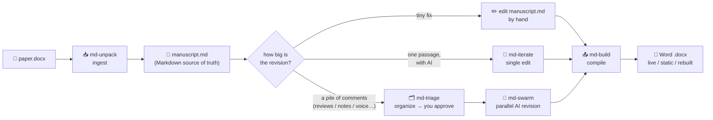

# md-paper

**English** · [中文](README.zh-CN.md)

> **Revise your academic paper with AI — without breaking a single Zotero citation, figure, table, or cross-reference.**
> Ingest Word → edit a Markdown source of truth → compile back to Word with live citations. A suite of [Claude Code](https://www.claude.com/product/claude-code) skills for the *last mile* from an AI draft to a submission-ready `.docx`.

> ⚠️ **v0.1 — early public (beta) release.** Battle-tested on the author's real journal submissions, but new to other people's machines and manuscripts. Please read [Known Limitations](#known-limitations) and open an issue if anything breaks.

---

## One picture

| Editing Word by hand | md-paper (Markdown source + AI + pandoc) |
|---|---|
| 😫 Revise every reviewer comment one by one | ✅ **Swarm**: drop the whole pile in, AI revises in batch |
| 😫 One Zotero *Refresh* wrecks your citations | ✅ **Live Zotero fields survive** — Refresh anytime |
| 😫 Figure/table numbers scramble after edits | ✅ **Auto-numbering + cross-references**, never wrong |
| 😫 Word formatting breaks; Ctrl+Z is your only hope | ✅ **Plain-text Markdown source** — git-versioned, always recoverable |
| 😫 You discover a lost citation three rounds too late | ✅ **Never-drop-a-citation hard gate** |
| 😫 Endless copy-paste between the browser and Word | ✅ **Everything in the editor** — zero pasting |
| 😫 The result reeks of "AI writing" | ✅ **Seven de-AI rules** lower the machine-written signal |

## Why md-paper — the seven pain points it solves

AI is great at rewriting prose, but social-science authors (economics, management, sociology…) submit in **Word**, and the moment you paste AI output back, everything academic falls apart. md-paper fixes each of these:

1. **The web-AI copy-paste loop.** Chatting paragraph-by-paragraph, then pasting each result back into Word, burns a whole afternoon for 30 minutes of real thinking. → *Dump comments in; AI applies them to the Markdown source; you only think at the approval gate.*
2. **Auto-revision tools are LaTeX-only.** Great pipelines exist for CS/math/physics, but social science lives in Word. → *Write Markdown, compile to a perfectly formatted `.docx` with pandoc. No LaTeX, no hand-coding Word.*
3. **Figures, tables, captions, notes, and Zotero fields scramble the instant AI touches Word.** → *Output carries **live Zotero fields**, auto-numbered figures/tables, cross-references that never break, and table notes preserved.*
4. **One comment at a time — no batch, no multi-agent.** Typing 30 reviewer comments into prompts and pasting back 30 results is a full day. → ***Swarm**: 30 comments → auto-classified/merged → you approve once → parallel agents draft, a deterministic script lands them safely.*
5. **Vague comments take forever to execute.** "Remove all first person", "tighten the lit review" — easy to understand, a full day to do. → *Baked-in language rules turn "remove all first person" into a single swarm task.*
6. **Citations vanish silently mid-revision.** A real, measured failure: AI quietly drops a reference or mangles a citekey, and you notice rounds later. → *A hard gate **refuses** to drop a citation; a checker lists every dropped/split citation and dangling cross-reference. Figures, tables, and equations are watched the same way.*
7. **The revised paper reads like a machine wrote it.** Reviewers increasingly spot AI text. → *Seven de-AI rules (short sentences, fewer em-dashes, break the symmetry…) are baked into the revision flow. Change only *how* it's said, never *what*.*

## What you get — core features

- 🔗 **Zotero-native** — live citation fields in the output; press Refresh in Word and citations + bibliography come alive.
- 🖼️ **Figures, tables, captions & notes** — plain text in the source; adding/replacing/reordering is trivial and safe.
- 🔀 **Cross-references** — `[@fig:x]` / `[@tbl:x]` / `[@eq:x]` auto-number and re-number; they never dangle.
- 🐝 **Swarm mode** — a pile of comments → AI batch-revises in parallel → you approve → it lands, deterministically.
- 🛡️ **Never-drop-a-citation** — the strictest citation guard; a patch that loses a `[@key]` is hard-rejected.
- 📝 **Plain-text Markdown source** — readable, editable, `git diff`-able, cross-platform; formatting can't silently break.
- 🔄 **De-AI (humanize)** — seven rewriting rules so the revised prose reads human, citations untouched.
- 🧮 **Equations** — Word OMML converts to LaTeX automatically (legacy AxMath equations are left as fill-in placeholders).
- 🧰 **One global toolchain** — pandoc + crossref + Zotero filters install once and are shared by every project.
- 🧩 **Built as Claude Code skills** — composable, driven by natural language, no GUI.

---

## Install

The whole suite installs itself **by asking your AI to do it**. In any [Claude Code](https://www.claude.com/product/claude-code) (or compatible agent) session, after cloning this repo:

```
git clone https://github.com/pwya/md-paper.git
```

then tell your AI:

> **"Read `INSTALL.md` in the md-paper folder and set up md-paper for me."**

The AI will follow [INSTALL.md](INSTALL.md) — an executable runbook — to link the five skills into Claude Code, install the pandoc toolchain, and register the protection hooks. It's written for an agent to run step by step; you don't type the commands yourself.

Prefer to do it by hand? INSTALL.md also lists every command. **Requirements:** Windows + Microsoft Word (for ingest), Python 3, PowerShell; Zotero + Better BibTeX optional (only for live-citation mode).

---

## How to use

md-paper is a five-stage pipeline. **You always start with `md-unpack` and finish with `md-build`;** the middle depends on how much you're changing.



**The five skills, in order:**

1. **`md-unpack`** — *ingest.* Turns your Word `.docx` into `manuscript.md`, a plain-text Markdown source of truth (citations, figures, cross-references, footnotes all preserved). **Always run this first.**
2. **`md-triage`** — *organize.* Turns a pile of revision intents — reviewer comments, a supervisor's email, meeting notes, a PDF — into a clean checklist you review and approve. *(Big revisions only.)*
3. **`md-swarm`** — *batch-revise.* Parallel AI agents apply the approved checklist to the manuscript, citation-safe. *(Big revisions only.)*
4. **`md-iterate`** — *polish one passage.* Ask AI to revise a single selected paragraph. *(Small edits — no triage/swarm needed.)*
5. **`md-build`** — *compile.* Turns `manuscript.md` back into Word (`live` / `rebuild` / `static`), and asks your page format once, then remembers it. **Always run this last.**

**In one line:** `md-unpack` → (hand-edit · or `md-iterate` · or `md-triage` + `md-swarm`) → `md-build`.

> 📖 **Full walkthrough, per-skill internals, command cheat-sheet, and a 30-comment worked example:** see the [User Guide](md-技能套件·用户完全手册.md) (中文).

---

## Known Limitations

An honest list of what this release does *not* do smoothly. None causes silent data loss — there are loud warnings — but you should know them:

1. **Ingest is Windows + Word only.** `md-unpack` drives Microsoft Word via COM; macOS is not supported yet. (Everything after ingest is cross-platform.)
2. **Citations must be Zotero + Better BibTeX.** EndNote, Citavi, and hand-typed citations are **not** recovered as live fields.
3. **`rebuild` mode & page locators.** The same source cited at different pages (`[@a, p.5]` vs `[@a, p.99]`) may get the same page number offline — use `live` mode or check by hand.
4. **Escaping in footnotes / table cells / figure captions.** A sentinel *warns* you about risky characters there but does not auto-fix them.
5. **Collapsed floating figures.** A few floating/grouped figures can land at the document front during ingest; they're routed to an "unanchored figures — place manually" section with their caption and a suggested home restored.
6. **Legacy AxMath equations** are left as `[TODO: re-enter LaTeX]` placeholders (with a preview image). Native Word (OMML) equations convert automatically.

## License & credits

- **Workflow code:** [Apache-2.0](LICENSE) © 2026 Yuang Panwang (潘王雨昂).
- **Third-party:** pandoc & pandoc-crossref (GPL-2.0) are *downloaded at setup*, not redistributed here; the bundled Zotero/Lua filters are MIT. See [NOTICE](NOTICE).

Citations by [Zotero](https://www.zotero.org) + [Better BibTeX](https://retorque.re/zotero-better-bibtex/); typesetting by [pandoc](https://pandoc.org) + [pandoc-crossref](https://github.com/lierdakil/pandoc-crossref).
