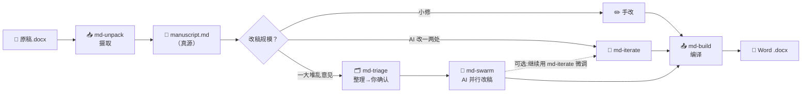
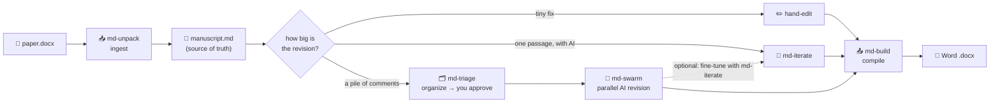

# md 系列技能：解决「AI 到论文」的最后一公里 · 
### *The Last Mile from AI to a Finished Paper*
---


🌐 [**中文**](#中文说明) · [English](#english)

<a id="中文说明"></a>
## 中文说明

### 当前 AI 辅助学术写作的七大痛点

**痛点 1:网页端 AI 的"对话—复制—粘贴"死循环。**
在 ChatGPT / Claude 网页端和 AI 对话改论文,看起来省了思考,实则陷入更耗精力的体力活:**每改一段就要复制粘贴一轮**——"把这一段改得更学术"→ 等回复 → 选中 → Ctrl+C → 切回 Word → Ctrl+V → 格式崩了 → 调格式 → 下一段……一个下午过去,真正动脑的时间不到半小时。
> ✅ **md-paper:意见批量扔进去,AI 自动逐条改到 Markdown 真源里**,你只在人工闸确认时动一次脑,其余体力活全免。

**痛点 2:一次只能改一条意见,无法批量多 Agent 修改。**
你和网页端 AI 对话时,一次只能说一件事:"帮我把引言改得更简洁"。说完等回复,再粘贴,再说下一件。**就算你自己完全理解了 30 条审稿意见,把它们逐一打字成 prompt 再逐一粘贴结果,就已经耗尽了一整天**——根本没有"批量多 Agent 并行修改"的可能。
> ✅ **md-paper:蜂群模式(Swarm)**——30 条审稿意见扔进去,AI 自动分类、去重、合并(`md-triage`)→ 你一次性确认 → **并行**派多个 agent 起草、确定性脚本**串行落盘**到真源(`md-swarm`)。从"一次改一条"升级到"一次改一整轮审稿"。

**痛点 3:Word 里的图、表、题注、注释、Zotero 域——AI 一改全乱。**
Word 文档里嵌着丰富的学术基础设施:图的题注("Figure 1: …")、表的题注和注释("Note: …")、Zotero 引用域、交叉引用书签……用网页端 AI 改完粘贴回 Word 时,**这些全部丢失或错乱**。更致命的是 Zotero Refresh 一下,之前精心调整的引用格式全部打回原形。
> ✅ **md-paper:出稿自带活 Zotero 域**(Word 里 Refresh 即用),**图表自动编号 + 交叉引用永远不错**,表下注释原生保留。纯文本真源改不坏。

**痛点 4:审稿意见太笼统,自己生成初稿耗时耗力。**
"请把文章中的第一人称改为客观第三人称"、"减少语法纰漏"、"提高文献综述的覆盖面"……这类审稿意见**理解起来不难,但执行起来极其耗时**:你要通读全文找每一处 I/we/our,逐一替换;要逐句检查语法;要翻遍文献补漏。审稿人一句话,你要干一整天。
> ✅ **md-paper:去 AI 味 + 语言铁律内嵌在子 Agent 契约里**。笼统意见交给 AI 逐条落地——"全文去第一人称"就是一个 swarm 任务,几分钟改完,你只做最终确认。

**痛点 5:改稿过程中引用静默丢失,发现时已晚。**
这是开发过程中实际测量到的**真实事故类型**:AI 改稿时会"顺手"删掉它觉得不重要的引用、拆散成组引用 `[@a; @b; @c]`、把 citekey 改错一个字母——等你发现时已经过了好几轮修改,根本追溯不到是哪一步丢的。
> ✅ **md-paper:引用默认不删硬闸**——补丁模式下少一条引用直接拒写;**引用体检**——改完后自动列出每一条被丢的 citekey、被拆的引用组、无定义的交叉引用。图、表、公式(带编号的)也一样,每个改稿批次都被数着。

**痛点 6:改完的稿子读起来像 AI 写的。**
AI 重度润色后的论文有一股"AI 味"——句子工整对称、修辞堆砌、破折号泛滥、读起来不像人写的。期刊审稿人越来越容易识别 AI 生成文本,这对投稿是致命伤。
> ✅ **md-paper:七条去 AI 味铁律**内嵌在改稿流程里——少修辞、短句、打破工整、降正式度、保信息、少破折号、全覆盖。只改"怎么说",不改"说什么"。

**痛点 7:AI 改稿无人复核,错了不知道错在哪。**
AI 改稿最大的风险不是改得不好,而是改错了你不知道——一条引用被悄悄删掉、一段话被改窜了意思、前后术语对不上,等终审才发现已经过了好几轮。网页端 AI 给你一段结果,你只能接受或粘贴回去重问,中间没有任何“复核”环节,更没人替你盯着每一条改动。
> ✅ **md-paper:三省制 + 多道校验**——借鉴唐代三省“中书起草、门下审核、尚书执行”之意,把改稿拆成**提(整理意图)/ 行(起草)/ 审(只读审计)**三权分立、互不兼任。改稿全程跑**多道校验**:每个批次自动体检引用有没有丢、有没有凭空编造、有没有真正落地;全部改完后再跑两道**只读终审**——D 审计逐条核“做没做、做对没”,E 复查通读全文查前后矛盾。AI 只起草、只出报告,**最终裁决权始终在你手里**。

### 一表胜千言

| 传统改稿（手搓 Word） | md-paper（Markdown 真源 + AI + pandoc） |
| --- | --- |
| 😫 手动逐条改审稿意见 | ✅ **蜂群模式**:一堆意见扔进去,AI 批量改 |
| 😫 Zotero Refresh 一下引用全毁 | ✅ **不毁 Zotero 域**——出稿自带活引用域,Refresh 即用 |
| 😫 插图表后题注编号全乱 | ✅ **图表自动编号 + 交叉引用**,永远不错 |
| 😫 Word 格式崩了只能 Ctrl+Z | ✅ **Markdown 纯文本真源**,git 版本控制 |
| 😫 改到一半发现引用对不上 | ✅ **引用默认不删硬闸** |
| 😫 网页端复制粘贴到手软 | ✅ **全流程在编辑器内**,零粘贴 |
| 😫 改完一股 AI 味被审稿人识破 | ✅ **七条去 AI 味铁律** |
| 😫 AI 改稿无人复核,错了不知错在哪 | ✅ **三省制 + 多道校验**,两道只读终审 |

### 核心特性

🔗 兼容 Zotero 活引用域 · 🖼️ 图/表/题注/注释纯文本 · 🔀 交叉引用自动编号 · 🐝 并行蜂群改稿 · 🛡️ 引用默认不删 · 📝 可 git diff 的 Markdown 真源 · 🔄 去 AI 味 · 🧮 OMML→LaTeX 公式 · 🧰 全局工具链 · 🧩 开放 Agent Skills 标准——Claude Code / Codex / OpenCode / Hermes 通用 · 🏛️ 三省制(提/行/审分权)· 多道校验审计。

### 我们的立场:AI 是助手,不是作者

md-paper 的流程很长——摄取、整理、起草、审计、出稿,每一步都有**人工闸**:意见要你确认才落地、改动要你审阅才通过、引用增删要你授权。把整个流程走完,稿子本质上还是**你自己的东西**。AI 省去的是打字、粘贴、调格式、逐条发命令这些体力活,但**该你动脑的地方一个没少**:审稿意见怎么理解、改到什么程度、引用留哪些删哪些、终稿定不定稿,全是你的决策。

我们的立场:**AI 只是辅助,让改稿更便捷,但不能代替作者本人的思维与原创。** 工具替你跑腿,不替你思考。

### 安装——让 AI 替你装

**第一步:把这个仓库弄到你电脑上。** 两种方式,任选一种:

- **不会命令行(推荐给小白):** 点这个页面右上角绿色的 **`< > Code`** 按钮 → **Download ZIP** → 下载后**解压**到一个你记得住的文件夹。
- **会用 git:** 在终端运行
  ```
  git clone https://github.com/pwya/md-paper.git
  ```

**第二步:用 [VS Code](https://code.visualstudio.com/) 打开这个文件夹。** 打开 VS Code → 菜单 **File → Open Folder(打开文件夹)** → 选中你刚解压/克隆出来的 **`md-paper`** 文件夹。然后在里面开一个 [Claude Code](https://www.claude.com/product/claude-code) 会话(或 Codex / OpenCode / Hermes Agent 等其他 AI 编程工具,均支持)。

**第三步:让 AI 替你装。** 对 AI 说:

> **"读一下 `INSTALL.md`,帮我把 md-paper 装好。"**

AI 会照着 [INSTALL.md](INSTALL.md)(一份可执行的操作手册)把五个技能接进你的 AI 工具(Claude Code / Codex / OpenCode / Hermes Agent 都行)、装 pandoc 工具链、注册保护钩子(Claude Code 专属的第二层物理防护,其他工具由 [AGENTS.md](AGENTS.md) 守则替代),**你一条命令都不用自己敲**。想手动装,INSTALL.md 里也逐条列了命令。

### 环境要求

- **Windows + Microsoft Word** —— 摄取(`md-unpack`)靠 Word COM 读引用域/图。*(macOS 暂不支持;摄取之后全跨平台。)*
- **Python 3** + **PowerShell**(Windows 自带 5.1 即可)。
- **AI 编程工具** —— 为 **Claude Code** 深度打造(独享"保护钩子"这层物理防线);同时兼容支持 Agent Skills 开放标准的其他工具:**Codex / OpenCode / Hermes Agent** 等(OpenCode 原生就会读 `~/.claude/skills`,零额外配置)。非 Claude Code 环境的防护由脚本内置闸门 + 仓库根 [AGENTS.md](AGENTS.md) 守则承担,详见 [INSTALL.md](INSTALL.md)。
- **Zotero + Zotero 的 Word 插件** —— 用来在最终 `.docx` 里**激活活引用**(Word 里点 **Refresh**)。**Better BibTeX** 只在 *live* 模式和**改稿时新增文献**才**额外必需**——常规流(摄取已有稿 → 改 → rebuild)**不需要**它。
- **建议用大上下文 AI 模型。** `md-swarm` 每个 agent 都要读整篇稿子,长论文建议 **200K+(最好 1M)上下文窗口**,免得读不全被截断。
- **pandoc 工具链** —— 由 `setup_md_tools.ps1` **自动安装**:从官方发布页下载**锁定版** pandoc 3.9.0.2 + crossref 0.3.24a(两者必须配套,脚本自动搞定,**你什么都不用下载/上传**)。⚠️ **国内网络往往下载不了 GitHub 上的 pandoc,可能需要开代理 / VPN**;也可以加 `-Mirror https://<镜像>` 走镜像。

### 怎么用

五阶段流水线。**永远从 `md-unpack` 开始、`md-build` 结束**,中间看你改多大。



**顺序是活的**——除了「`md-unpack` 永远第一步、`md-build` 永远最后一步」,中间的技能你可以**按自己的需求自由组合、反复使用**。三种典型顺序:

1. **小修**:`md-unpack` → 手改 `manuscript.md` → `md-build`
2. **单点 AI 润色**:`md-unpack` → `md-iterate` → `md-build`
3. **大改**:`md-unpack` → `md-triage` → `md-swarm` → *(可选:再用 `md-iterate` 微调几处)* → `md-build`

1. **`md-unpack`** —— *摄取。* Word `.docx` → `manuscript.md`(Markdown 真源)。**永远第一步。**

   > 💡 **为什么必须先转成 Markdown?** Word 是发展了几十年的庞然大物,`.docx` 内部是层层嵌套的祖传 XML——说"屎山"毫不夸张:图、表、题注、引用域、书签全绞在一起。目前市面上几乎所有工具都难以直接在 Word 里自动处理上面那些痛点(Anthropic 与 Copilot 的 Word 插件、Kimi 与 Gemini 的 Word 程序等同样如此)。唯一走得通的路就是:**先把 Word 转换成 AI 真正读得懂的 Markdown,改完再转换回去**——而且 Markdown 纯文本还**省 token**,同一篇论文的处理成本远低于直接塞 docx。
2. **`md-triage`** —— *整理。* 一堆修订意图 → 你审核确认的清单。*(仅大改。)*
3. **`md-swarm`** —— *批量改。* 多 AI agent 并行、引用安全地落地清单。*(仅大改。)*
4. **`md-iterate`** —— *润色单段*。*(小修。)*
5. **`md-build`** —— *出稿*,编回 Word。**永远最后一步。**

**一句话:** `md-unpack` → (手改 · 或 `md-iterate` · 或 `md-triage` + `md-swarm`) → `md-build`。

> 📖 完整演练、各技能内部流程、命令速查卡、30 条审稿意见实战:见**[用户完全手册](md-技能套件·用户完全手册.md)**。

### 已知限制

- **仅支持 Windows + Microsoft Word** —— `md-unpack` 靠 Word COM,macOS 暂不支持。
- *其他细微限制(引用来源、页码定位、个别转义、浮动图、老 AxMath 公式)未在此列出,见[用户完全手册](md-技能套件·用户完全手册.md)。*

### 许可

📝 每个版本改了什么:见 [更新日志 CHANGELOG.md](CHANGELOG.md)。

工作流代码 [Apache-2.0](LICENSE) © 2026 潘王雨昂 (Yuang Panwang)。第三方:pandoc 与 pandoc-crossref(GPL-2.0)安装时下载、不随仓库分发;内置 Zotero/Lua 过滤器为 MIT——见 [NOTICE](NOTICE)。

### 贡献者

[潘王雨昂](https://panwangyuang.com) · [张宇](https://yuzhang.net)

### 关注我们

欢迎关注微信公众号:**计算公共治理** · **人类有趣行为实验室**

<p>
  
  &nbsp;&nbsp;&nbsp;
  
</p>

---

<a id="english"></a>
## English

[⬆ 回到顶部 / back to top](#中文说明)

### The seven pain points of AI-assisted academic writing

**Pain 1 — The web-AI "chat → copy → paste" death loop.**
Revising a paper by chatting with ChatGPT / Claude in the browser looks like it saves thinking, but it traps you in worse manual labor: **every paragraph is a copy-paste round** — "make this more academic" → wait → select → Ctrl+C → back to Word → Ctrl+V → formatting broke → fix it → next paragraph… An afternoon gone, under 30 minutes of real thinking.
> ✅ **md-paper: drop the comments in, AI applies them one by one to the Markdown source.** You think once, at the approval gate; the grunt work is gone.

**Pain 2 — One comment at a time; no batch, no multi-agent.**
Chatting with a browser AI, you can only say one thing at a time: "make the intro more concise." Even if you fully understand 30 reviewer comments, **typing each into a prompt and pasting each result back already burns a full day** — parallel multi-agent revision is simply impossible.
> ✅ **md-paper: Swarm mode** — drop in 30 comments, AI classifies/dedups/merges them (`md-triage`) → you approve once → **parallel** agents draft, a deterministic script lands them **serially** into the source (`md-swarm`). From "one comment at a time" to "one whole review round at a time."

**Pain 3 — Figures, tables, captions, notes, Zotero fields all scramble the instant AI touches Word.**
A Word manuscript embeds rich academic infrastructure: figure captions, table captions and notes, Zotero citation fields, cross-reference bookmarks. Paste browser-AI output back into Word and **it's all lost or scrambled** — and one Zotero *Refresh* resets every citation you carefully adjusted.
> ✅ **md-paper: output carries live Zotero fields** (Refresh in Word), **auto-numbered figures/tables + cross-references that never break**, table notes preserved. A plain-text source can't be scrambled.

**Pain 4 — Vague comments take forever to execute.**
"Change first person to objective third person," "reduce grammatical slips," "broaden the literature review" — **easy to understand, brutally slow to do**: read the whole paper for every I/we/our and replace each; check every sentence's grammar; hunt down missing references. One reviewer sentence, one full day of work.
> ✅ **md-paper: de-AI rules + language rules are baked into the agent contract.** A vague comment becomes an executable task — "remove all first person" is a single swarm job, done in minutes; you just approve.

**Pain 5 — Citations vanish silently mid-revision, discovered too late.**
A **real, measured failure type** from development: while revising, AI quietly drops a citation it deems unimportant, splits a group `[@a; @b; @c]`, or mistypes one letter of a citekey — and by the time you notice, several rounds have passed and it's untraceable.
> ✅ **md-paper: a never-drop-a-citation hard gate** — in patch mode, losing one citation is hard-rejected; **a ref-check** lists every dropped citekey, split group, and dangling cross-reference after each revision. Figures, tables, and (numbered) equations are counted every batch too.

**Pain 6 — The revised paper reads like a machine wrote it.**
Heavily AI-polished prose has an "AI smell" — symmetric sentences, piled-up rhetoric, em-dashes everywhere. Reviewers increasingly spot machine-generated text, and that's fatal for a submission.
> ✅ **md-paper: seven de-AI rules** baked into the flow — less rhetoric, short sentences, break the symmetry, lower the formality, keep the information, fewer em-dashes, cover everything. Change only *how* it's said, never *what*.

**Pain 7 - AI revision with no review; errors hide until too late.**
The real risk of AI revision is not bad writing - it is wrong writing you never notice: a citation silently dropped, a passage whose meaning got twisted, terminology that no longer matches. By the time you catch it at final review, several rounds have passed. A browser AI hands you a result and you either accept it or paste it back and ask again - there is no "review" step, no one watching each change.
> ✅ **md-paper: three-province separation + multi-pass auditing.** Borrowing the Tang-dynasty *Three Departments* (draft / review / execute), revision is split into three non-overlapping roles: **propose** (organize intent) / **execute** (draft) / **audit** (read-only review). The whole run goes through **multiple checkpoints**: every batch auto-checks whether citations were dropped, fabricated, or actually landed; once all edits are done, two **read-only final audits** run - D audits each comment ("done? done right?"), E reads the full text for internal contradictions. AI only drafts and reports; **the final call is always yours**.

### One table, a thousand words

| Editing Word by hand | md-paper (Markdown source + AI + pandoc) |
|---|---|
| 😫 Revise every reviewer comment one by one | ✅ **Swarm**: drop the whole pile in, AI revises in batch |
| 😫 One Zotero *Refresh* wrecks your citations | ✅ **Live Zotero fields survive** — Refresh anytime |
| 😫 Figure/table numbers scramble after edits | ✅ **Auto-numbering + cross-references**, never wrong |
| 😫 Word formatting breaks; Ctrl+Z is your only hope | ✅ **Plain-text Markdown source** — git-versioned |
| 😫 You discover a lost citation three rounds too late | ✅ **Never-drop-a-citation hard gate** |
| 😫 Endless copy-paste between browser and Word | ✅ **Everything in the editor** — zero pasting |
| 😫 The result reeks of "AI writing" | ✅ **Seven de-AI rules** lower the machine-written signal |
| 😫 AI revises with no review; errors hide | ✅ **Three-province separation + multi-pass audits**, two read-only final reviews |

### Core features

🔗 Zotero-native live citation fields · 🖼️ figures/tables/captions/notes as plain text · 🔀 auto-numbered cross-references · 🐝 parallel swarm revision · 🛡️ never-drop-a-citation guard · 📝 git-diffable Markdown source · 🔄 de-AI humanizer · 🧮 OMML→LaTeX equations · 🧰 one shared toolchain · 🧩 open Agent Skills standard — works in Claude Code / Codex / OpenCode / Hermes · 🏛️ three-province separation (propose/execute/audit) + multi-pass auditing.

### Our stance: AI is an assistant, not the author

The md-paper pipeline is long - ingest, organize, draft, audit, compile - and every stage has a **human gate**: comments land only after you confirm, edits pass only after you review, citation changes need your authorization. Walk the whole pipeline and the manuscript is still **fundamentally yours**. What AI removes is the typing, pasting, format-fixing, and issuing commands one by one; **every place that needs your brain is still there**: how to read the reviewer comments, how far to go, which citations to keep or cut, whether the final draft is final - all your calls.

In one line: **AI is just an aid - it makes revision more convenient, but it cannot replace the author's own thinking and originality.** The tool runs your errands; it does not think for you.

### Install — let an AI do it

**Step 1 — Get this repo onto your computer.** Either way works:

- **No command line (easiest):** click the green **`< > Code`** button at the top of this page → **Download ZIP** → **unzip** it to a folder you'll remember.
- **If you use git:**
  ```
  git clone https://github.com/pwya/md-paper.git
  ```

**Step 2 — Open the folder in [VS Code](https://code.visualstudio.com/).** In VS Code: **File → Open Folder** → pick the **`md-paper`** folder you just unzipped/cloned. Then start a [Claude Code](https://www.claude.com/product/claude-code) session inside it (or Codex / OpenCode / Hermes Agent — all supported).

**Step 3 — Let an AI install it.** Tell your AI:

> **"Read `INSTALL.md` and set up md-paper for me."**

The AI follows [INSTALL.md](INSTALL.md) — an executable runbook — to link the five skills into your AI tool (Claude Code / Codex / OpenCode / Hermes Agent all work), install the pandoc toolchain, and register the protection hooks (a Claude Code-only second layer; other tools get the [AGENTS.md](AGENTS.md) rules instead). **You don't type a single command yourself.** Prefer manual? INSTALL.md lists every command.

### Requirements

- **Windows + Microsoft Word** — ingest (`md-unpack`) reads Word citation fields/figures via COM. *(macOS not supported yet; everything after ingest is cross-platform.)*
- **Python 3** and **PowerShell** (Windows-native 5.1 is fine).
- **AI coding tool** — built first for **Claude Code** (which alone gets the physical protection-hook layer); also compatible with any tool speaking the open Agent Skills standard: **Codex / OpenCode / Hermes Agent**, etc. (OpenCode natively reads `~/.claude/skills` — zero extra setup). Outside Claude Code, protection falls to the scripts' built-in gates plus the [AGENTS.md](AGENTS.md) rules; see [INSTALL.md](INSTALL.md).
- **Zotero + the Zotero Word plugin** — to activate the live citations in your final `.docx` (press **Refresh** in Word). **Better BibTeX** is additionally required **only** for *live* mode and for **adding new references during revision** — it is **not** needed for the common flow *ingest an existing paper → revise → rebuild*.
- **A large-context AI model (recommended).** `md-swarm` reads your whole manuscript in each agent; for long papers a **200K+ (ideally 1M) context window** avoids truncation.
- **pandoc toolchain** — installed **automatically** by `setup_md_tools.ps1`, which downloads the **pinned** pandoc 3.9.0.2 + pandoc-crossref 0.3.24a from the official releases (the two versions must match — the installer handles it; **you download nothing**). ⚠️ **If GitHub downloads fail (common in restricted networks), you may need a proxy / VPN**; or pass `-Mirror https://<a-github-mirror>`.

### How to use

Five-stage pipeline. **Always start with `md-unpack`, finish with `md-build`;** the middle depends on how much you're changing.



**The order is flexible** — apart from "`md-unpack` always first, `md-build` always last", you can **combine and repeat the middle skills however your revision demands**. Three typical orders:

1. **Tiny fix:** `md-unpack` → hand-edit `manuscript.md` → `md-build`
2. **Single-passage AI polish:** `md-unpack` → `md-iterate` → `md-build`
3. **Major revision:** `md-unpack` → `md-triage` → `md-swarm` → *(optional: fine-tune a few spots with `md-iterate`)* → `md-build`

1. **`md-unpack`** — *ingest.* Word `.docx` → `manuscript.md` (Markdown source of truth). **Run first.**

   > 💡 **Why convert to Markdown first?** Word has evolved for decades; a `.docx` is a mountain of deeply nested legacy XML — figures, tables, captions, citation fields, and bookmarks all tangled together. Almost no tool on the market can automate the pain points above directly inside Word (the Anthropic and Copilot Word add-ins, Kimi's and Gemini's Word products included). The only path that works: **convert Word into Markdown that AI can genuinely read, revise there, then convert back** — and plain-text Markdown also **saves tokens**, so processing the same paper costs far less than feeding it docx.
2. **`md-triage`** — *organize.* A pile of revision intents → a checklist you approve. *(Big revisions only.)*
3. **`md-swarm`** — *batch-revise.* Parallel AI agents apply the approved checklist, citation-safe. *(Big revisions only.)*
4. **`md-iterate`** — *polish one passage* with AI. *(Small edits.)*
5. **`md-build`** — *compile* back to Word. **Run last.**

**In one line:** `md-unpack` → (hand-edit · or `md-iterate` · or `md-triage` + `md-swarm`) → `md-build`.

> 📖 Full walkthrough, per-skill internals, command cheat-sheet, and a 30-comment worked example: **[User Guide](md-技能套件·用户完全手册.md)** (中文).

### Known Limitations

- **Windows + Microsoft Word only** — `md-unpack` drives Word via COM; macOS is not supported yet.
- *Other minor limitations (citation providers, page locators, escaping edge cases, floating figures, legacy AxMath equations) are not listed here — see the [User Guide](md-技能套件·用户完全手册.md).*

### License

📝 What changed in each version: see the [CHANGELOG](CHANGELOG.md).

Workflow code [Apache-2.0](LICENSE) © 2026 Yuang Panwang (潘王雨昂). Third-party: pandoc & pandoc-crossref (GPL-2.0) are *downloaded at setup*, not redistributed here; bundled Zotero/Lua filters are MIT — see [NOTICE](NOTICE).

### Contributors

[Yuang Panwang 潘王雨昂](https://panwangyuang.com) · [Yu Zhang 张宇](https://yuzhang.net)

### Follow us

WeChat official accounts: **计算公共治理** (Computational Public Governance) · **人类有趣行为实验室** (Fun Human Behavior Lab)

<p>
  
  &nbsp;&nbsp;&nbsp;
  
</p>
