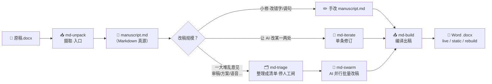

# md-paper

[English](README.md) · **中文**

> **用 AI 改论文——不毁任何一个 Zotero 引用、图、表、交叉引用。**
> Word 摄取 → 改一份 Markdown 真源 → 编回带活引用的 Word。一套 [Claude Code](https://www.claude.com/product/claude-code) 技能,专治"从 AI 初稿到能投稿的 `.docx`"这**最后一公里**。

> ⚠️ **v0.1 · 首个公开测试版。** 引擎已在作者真实投稿中反复验证,但初次面向他人的机器与稿件。请先读[已知限制](#已知限制),出问题请提 issue。

---

## 一图胜千言

| 传统改稿（手搓 Word） | md-paper（Markdown 真源 + AI + pandoc） |
| --- | --- |
| 😫 手动逐条改审稿意见 | ✅ **蜂群模式**:一堆意见扔进去,AI 批量改 |
| 😫 Zotero Refresh 一下引用全毁 | ✅ **不毁 Zotero 域**——出稿自带活引用域,Refresh 即用 |
| 😫 插图表后题注编号全乱 | ✅ **图表自动编号 + 交叉引用**,永远不错 |
| 😫 Word 格式崩了只能 Ctrl+Z | ✅ **Markdown 纯文本真源**,git 版本控制、永远可回溯 |
| 😫 改到一半发现引用对不上 | ✅ **引用默认不删硬闸**:没授权绝不去掉任何一条引用 |
| 😫 网页端复制粘贴到手软 | ✅ **全流程在编辑器内**:改完即所得,零粘贴 |
| 😫 改完一股 AI 味被审稿人识破 | ✅ **七条去 AI 味铁律**:尽可能降低 AI 率 |

## 为什么选 md-paper——它解决的七大痛点

AI 很擅长改文字,但社科作者（经济学 / 管理学 / 社会学……）**主流投稿格式是 Word**,你一把 AI 的结果粘回 Word,所有学术基础设施就崩了。md-paper 逐条解决:

1. **网页端 AI 的"对话—复制—粘贴"死循环。** 每改一段就复制粘贴一轮,一个下午过去、真正动脑不到半小时。→ *意见批量扔进去,AI 自动改到 Markdown 真源里,你只在人工闸确认时动一次脑。*
2. **绝大多数自动改稿工具只支持 LaTeX,不支持 Word。** CS/数学/物理有大量 LaTeX 工具链,但社科活在 Word 里。→ *Markdown 写作 + pandoc 编译出格式完美的 `.docx`,不学 LaTeX、不手搓 Word。*
3. **Word 里的图、表、题注、注释、Zotero 域——AI 一改全乱。** → *出稿自带**活 Zotero 域**(Refresh 即用)、图表自动编号、交叉引用永远不错、表下注释原生保留。*
4. **一次只能改一条意见,无法批量多 Agent。** 把 30 条审稿意见逐一打字成 prompt、逐一粘贴结果,就耗尽一天。→ ***蜂群模式**:30 条意见 → AI 自动分类去重合并 → 你一次性确认 → 并行起草、确定性脚本串行落盘。*
5. **审稿意见太笼统,自己执行耗时耗力。** "全文去第一人称""提高文献覆盖面"——理解不难,执行极慢。→ *语言铁律内嵌在契约里,"全文去第一人称"就是一个 swarm 任务,几分钟改完。*
6. **改稿过程中引用静默丢失,发现时已晚。** 这是开发中实测到的真实事故:AI 顺手删引用、拆引用组、改错 citekey,几轮后才发现。→ *引用默认不删**硬闸**:少一条直接拒写;引用体检列出每一条被丢/被拆/悬空的引用。图、表、公式同样被盯着。*
7. **改完的稿子读起来像 AI 写的。** 审稿人越来越容易识破 AI 文本。→ *七条去 AI 味铁律(短句、少破折号、打破工整……)内嵌在流程里。只改"怎么说",不改"说什么"。*

## 核心特性

- 🔗 **兼容 Zotero** —— 出稿自带活引用域,Word 里 Refresh 即成正式引用 + 文献表。
- 🖼️ **图 + 表 + 题注 + 注释** —— 真源里是纯文本,增删重排都安全。
- 🔀 **交叉引用** —— `[@fig:x]`/`[@tbl:x]`/`[@eq:x]` 自动编号、自动重排,永不悬空。
- 🐝 **蜂群模式** —— 一堆意见 → AI 并行批量改 → 你确认 → 确定性落字。
- 🛡️ **引用默认不删** —— 史上最严引用保护;补丁丢了 `[@key]` 直接硬拒。
- 📝 **Markdown 纯文本真源** —— 可读、可改、可 `git diff`、跨平台,格式不会静默崩。
- 🔄 **去 AI 味** —— 七条改写铁律让成稿读起来像人,引用分毫不动。
- 🧮 **公式** —— Word OMML 自动转 LaTeX(老 AxMath 公式留占位待手补)。
- 🧰 **全局工具链** —— pandoc + crossref + Zotero 过滤器一次装好、所有项目共用。
- 🧩 **以 Claude Code 技能形态构建** —— 可组合、自然语言驱动、无 GUI。

---

## 安装

整套东西**让你的 AI 替你装**。在任意 [Claude Code](https://www.claude.com/product/claude-code)(或兼容的 agent)会话里,克隆本仓库:

```
git clone https://github.com/pwya/md-paper.git
```

然后对你的 AI 说:

> **"读一下 md-paper 文件夹里的 `INSTALL.md`,帮我把 md-paper 装好。"**

AI 会照着 [INSTALL.md](INSTALL.md)(一份可执行的操作手册)把五个技能接进 Claude Code、装好 pandoc 工具链、注册保护钩子。整个过程是写给 agent 一步步执行的,**你不用自己敲命令**。

想手动装?INSTALL.md 里也列了每一条命令。**环境要求:** Windows + Microsoft Word(摄取用)、Python 3、PowerShell;Zotero + Better BibTeX 可选(仅活引用模式需要)。

---

## 怎么用

md-paper 是五阶段流水线。**永远从 `md-unpack` 开始、`md-build` 结束**;中间怎么走,看你改动多大。



**五个技能,按顺序:**

1. **`md-unpack`** —— *摄取。* 把 Word `.docx` 转成 `manuscript.md`(纯文本 Markdown 真源,引用/图/交叉引用/脚注全保住)。**永远第一步。**
2. **`md-triage`** —— *整理。* 把一堆修订意图(审稿意见、导师邮件、会议记录、PDF)理成一份你审核确认的清单。*(仅大改需要。)*
3. **`md-swarm`** —— *批量改。* 多 AI agent 并行、引用安全地把已确认的清单落到稿子上。*(仅大改需要。)*
4. **`md-iterate`** —— *润色单段。* 让 AI 改你指定的一段。*(小修——不经 triage/swarm。)*
5. **`md-build`** —— *出稿。* 把 `manuscript.md` 编回 Word(`live`/`rebuild`/`static`),首次问一次页面格式、以后自动记住。**永远最后一步。**

**一句话:** `md-unpack` → (手改 · 或 `md-iterate` · 或 `md-triage` + `md-swarm`) → `md-build`。

> 📖 **完整演练、各技能内部流程、命令速查卡、30 条审稿意见实战:** 见[用户完全手册](md-技能套件·用户完全手册.md)。

---

## 已知限制

诚实列出本版本**做得还不顺**的地方。没有一样会造成静默数据丢失(都有大声警告),但你该知道:

1. **摄取仅 Windows + Word。** `md-unpack` 靠 Word COM,macOS 暂不支持(摄取之后全跨平台)。
2. **引用仅支持 Zotero + Better BibTeX。** EndNote、Citavi、手打引用**不**会被还原成活域。
3. **`rebuild` 模式与页码。** 同一文献引在不同页(`[@a, p.5]` vs `[@a, p.99]`)离线可能取同一页码——用 `live` 或手动核对。
4. **脚注 / 表格单元格 / 图题的转义。** 哨兵会**警告**其中的危险字符,但不自动修。
5. **塌缩浮动图。** 少数浮动/组合图摄取时会落到文档最前面;已路由到"未锚定图——请手动放置"段,并还原题注 + 建议去处。
6. **老 AxMath 公式** 留 `[TODO: 重输 LaTeX]` 占位(带预览图)。Word 原生(OMML)公式自动转。

## 许可与致谢

- **工作流代码:** [Apache-2.0](LICENSE) © 2026 潘王雨昂 (Yuang Panwang)。
- **第三方:** pandoc 与 pandoc-crossref(GPL-2.0)安装时下载、不随仓库分发;内置 Zotero/Lua 过滤器为 MIT。见 [NOTICE](NOTICE)。

引用由 [Zotero](https://www.zotero.org) + [Better BibTeX](https://retorque.re/zotero-better-bibtex/) 驱动;排版由 [pandoc](https://pandoc.org) + [pandoc-crossref](https://github.com/lierdakil/pandoc-crossref) 完成。
