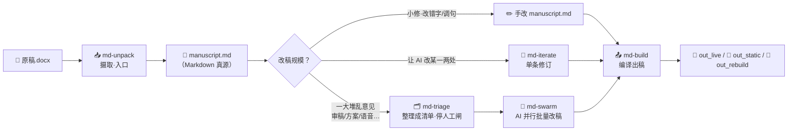
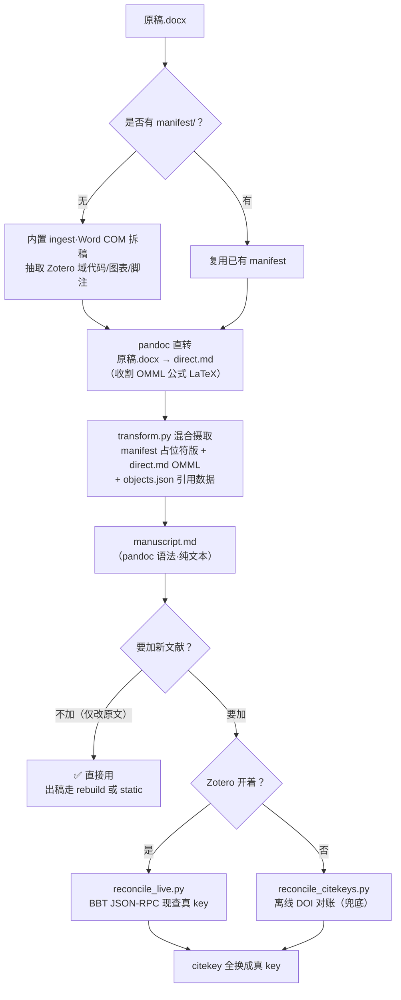
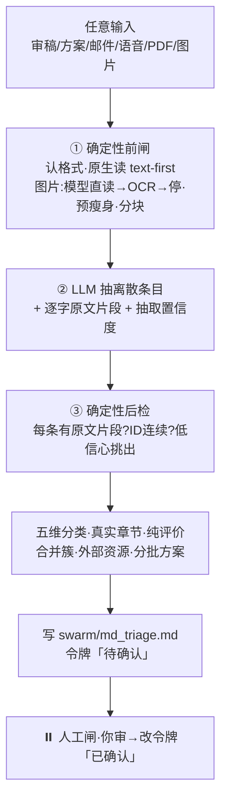
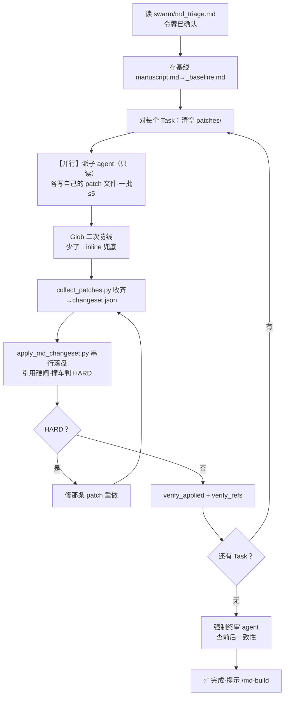
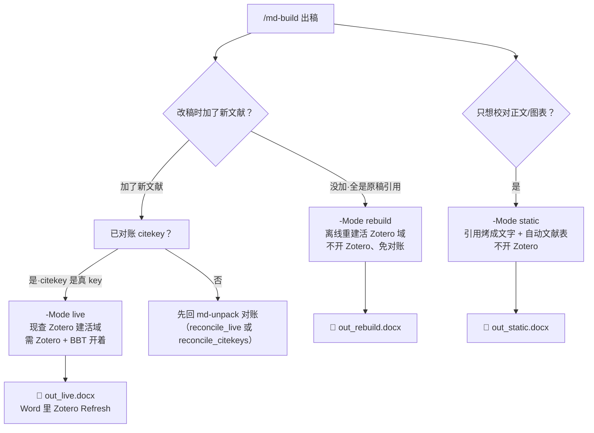

# md-* 技能套件 · 用户完全手册

> **Markdown 真源学术写作工具链——从 Word 原稿到带活 Zotero 引用的新稿，全程 AI 辅助、纯文本安全、pandoc 编译。**
>
> 本手册写给**作者（用户）**：不用懂代码，读完就能独立完成"原稿摄取 → AI 批量改稿 → 出带活 Zotero 域的 Word"全流程。
> 各技能的完整行为定义在其各自的 `SKILL.md`（随技能一起安装）。
>
> **建立**：2026-06-17 · **版本**：v0.11

---

> ⚠️ **内测用户须知（用之前先看这三条，能省掉绝大多数"怎么坏了"的麻烦）**
>
> 1. **只在 Windows + 装了 Microsoft Word 的电脑上用。** 摄取原稿要调 Word（Mac 暂不支持）；路径含中文/空格时，让 AI 用 PowerShell 工具跑脚本，**别用 Bash**（会乱码失败）。
> 2. **第一次用，必须先确认两个"防护钩子"真生效了，再开始改稿。** 这俩钩子是防止 AI 改稿时把你的引用/正文改丢的命脉闸——没装上 = 没保护，而且**不报警**。装法见仓库根目录的 `INSTALL.md`，装完**新开一个 Claude 会话**再跑 `md-swarm\verify_hooks.ps1`，要看到 **6/6 green** 才算数；看不到 = 钩子没生效，**先别改稿**，照该节排查（junction 在不在 / settings.json 注册没 / 重启 Claude Code 没 / `.ps1` 是不是 UTF-8 带 BOM）。**⚠️ "重启 Claude Code" 这步特别容易做错**：在 VS Code 里要**新开一个 Claude 对话**，不是关掉面板再打开（重开若恢复了旧会话、钩子还是没加载）；`/clear` 对钩子不可靠、别用它充重启。
> 3. **这几类稿子现在还处理不了，别拿它们来试，否则会出坏稿：**
>    - **AxMath 编辑的公式**：会变成 `$$\text{[TODO 重输 LaTeX]}$$` 占位，需你手动补 LaTeX（Word 原生公式不受影响）。
>    - **行内公式 / 同行排多个图**：可能在 Word 里显示成字面 `[EQ-2]`。
>    - **脚注、表格单元格、图题里含 `$` `[` 等符号**：可能被误当成公式或链接渲染错。
>    - **重度中文排版 / 复杂合并单元格的表**：表格结构还原会丢。
>    - **用 EndNote / Citavi / 手打引用的稿**：引用管线只认 **Zotero + Better BibTeX**，其它引用不会被还原成活域。
>    - **有浮动图 / 组合图的稿**：少数图摄取时会落到文档最前面（已隔离到"未锚定图"段、还原题注并给"建议去处"，需你手动拖回正文）。
>    - **`rebuild` 模式 + 同一文献多页码**：可能取到同一页码——要精确页码就用 `-Mode live`，或手动核对。
>
> 现阶段最稳的是**英文、纯文字为主、用 Word 原生公式（或无公式）、引用用 Zotero** 的社科稿。带上述特征的稿子等后续版本再试——出了问题不是你操作错，是工具还没覆盖到。

---

# 第一部分：核心优势——为什么选 md-*？

> 每一条都是真机实测跑通、不是"设计目标"。

## 当前 AI 辅助学术写作的七大痛点

做这套工具链之前，我们和几十位经济学/管理学/社会学博士生聊过"用 AI 写论文到底卡在哪"。下面是大家反复提到的痛点——**每一条，md-* 套件都恰好能解决**。

### 痛点 1：网页端 AI 的"对话—复制—粘贴"死循环

在 ChatGPT / Claude 网页端和 AI 对话改论文，看起来省了思考，实则陷入更耗精力的体力活：**每改一段就要复制粘贴一轮**——"把这一段改得更学术"→ 等回复 → 选中 → Ctrl+C → 切回 Word → Ctrl+V → 格式崩了 → 调格式 → 下一段……一个下午过去，真正动脑的时间不到半小时。

> ✅ md-* 方案：**意见批量扔进去，AI 自动逐条改到 Markdown 真源里**，你只在人工闸确认时动一次脑，其余体力活全免。

### 痛点 2：一次只能改一条意见，无法批量多 Agent 修改

你和网页端 AI 对话时，一次只能说一件事："帮我把引言改得更简洁"。说完等回复，再粘贴，再说下一件。**就算你自己完全理解了 30 条审稿意见，把它们逐一打字成 prompt 再逐一粘贴结果，就已经耗尽了一整天**——根本没有"批量多 Agent 并行修改"的可能。

> ✅ md-* 方案：**蜂群模式（Swarm）**——30 条审稿意见扔进去，AI 自动分类、去重、合并（`md-triage`）→ 你一次性确认 → **并行**派多个 agent 起草、确定性脚本**串行落盘**到真源（`md-swarm`）。从"一次改一条"升级到"一次改一整轮审稿"。

### 痛点 3：Word 里的图、表、题注、注释、Zotero 域——AI 一改全乱

Word 文档里嵌着丰富的学术基础设施：图的题注（"Figure 1: …"）、表的题注和注释（"Note: …"）、Zotero 引用域、交叉引用书签……用网页端 AI 改完粘贴回 Word 时，**这些全部丢失或错乱**。更致命的是 Zotero Refresh 一下，之前精心调整的引用格式全部打回原形。

> ✅ md-* 方案：**出稿自带活 Zotero 域**（Word 里 Refresh 即用），**图表自动编号 + 交叉引用永远不错**，表下注释原生保留。纯文本真源改不坏。

### 痛点 4：审稿意见太笼统，自己生成初稿耗时耗力

"请把文章中的第一人称改为客观第三人称"、"减少语法纰漏"、"提高文献综述的覆盖面"……这类审稿意见**理解起来不难，但执行起来极其耗时**：你要通读全文找每一处 I/we/our，逐一替换；要逐句检查语法；要翻遍文献补漏。审稿人一句话，你要干一整天。

> ✅ md-* 方案：**去 AI 味 + 语言铁律内嵌在子 Agent 契约里**。笼统意见交给 AI 逐条落地——"全文去第一人称"就是一个 swarm 任务，几分钟改完，你只做最终确认。

### 痛点 5：改稿过程中引用静默丢失，发现时已晚

这是 md-* 开发过程中实际测量到的**真实事故类型**：AI 改稿时会"顺手"删掉它觉得不重要的引用、拆散成组引用 `[@a; @b; @c]`、把 citekey 改错一个字母——等你发现时已经过了好几轮修改，根本追溯不到是哪一步丢的。

> ✅ md-* 方案：**引用默认不删硬闸**——补丁模式下少一条引用直接拒写；**引用体检（verify_refs.py）**——改完后自动列出每一条被丢的 citekey、被拆的引用组、无定义的交叉引用。
>
> 🆕 **图、表、公式现在也一样被盯着（2026-06-28）**：同一个 `verify_refs.py` 在**每个改稿批次**还会列出图/表/公式（带题注/编号的，`{#fig:}`/`{#tbl:}`/`{#eq:}`）相对改稿前**多了哪个、少了哪个、逐个点名**（删图删表是你的合法操作，所以这里**只提醒、不拦你**；但如果你删掉的图还被正文 `[@fig:x]` 引用着，会照旧报错拦下）。出稿时 `md-build` 还会再数一遍：**源里有几张图/表/公式、最终 Word 里就该有几个**，对不上就大声提醒（比如图片文件丢了、pandoc 没把某张图放进去）——同样**只提醒、不阻断出稿**。这样图表公式和引用一个待遇：从改稿到出稿全程有人数着。

### 痛点 6：改完的稿子读起来像 AI 写的

AI 重度润色后的论文有一股"AI 味"——句子工整对称、修辞堆砌、破折号泛滥、读起来不像人写的。期刊审稿人越来越容易识别 AI 生成文本，这对投稿是致命伤。

> ✅ md-* 方案：**七条去 AI 味铁律**内嵌在改稿流程里——少修辞、短句、打破工整、降正式度、保信息、少破折号、全覆盖。只改"怎么说"，不改"说什么"。

---

### 痛点 7：AI 改稿无人复核，错了不知道错在哪

AI 改稿最大的风险不是改得不好，而是改错了你不知道--一条引用被悄悄删掉、一段话被改窜了意思、前后术语对不上，等终审才发现已经过了好几轮。网页端 AI 给你一段结果，你只能接受或粘贴回去重问，中间没有任何“复核”环节，更没人替你盯着每一条改动。

> ✅ md-* 方案：**三省制 + 多道校验**--借鉴唐代三省“中书起草、门下审核、尚书执行”之意，把改稿拆成**提（整理意图）/ 行（起草）/ 审（只读审计）**三权分立、互不兼任。改稿全程跑**多道校验**：每个批次自动体检引用有没有丢、有没有凭空编造、有没有真正落地；全部改完后再跑两道**只读终审**--D 审计逐条核“做没做、做对没”，E 复查通读全文查前后矛盾。AI 只起草、只出报告，**最终裁决权始终在你手里**。

---

## 一图胜千言

| 传统改稿（手搓 Word） | md-paper（Markdown 真源 + AI + pandoc） |
| --- | --- |
| 😫 手动逐条改审稿意见 | ✅ **蜂群模式**：一堆意见扔进去，AI 批量改 |
| 😫 Zotero Refresh 一下引用全毁 | ✅ **不毁 Zotero 域**——出稿自带活引用域，Refresh 即用 |
| 😫 插图表后题注编号全乱 | ✅ **图表自动编号 + 交叉引用**，永远不错 |
| 😫 Word 格式崩了只能 Ctrl+Z | ✅ **Markdown 纯文本真源**，git 版本控制、永远可回溯 |
| 😫 改到一半发现引用对不上 | ✅ **引用默认不删硬闸**：没授权绝不去掉任何一条引用 |
| 😫 多人协作互相覆盖 | ✅ **人工闸确认**：AI 先出清单你点头，再逐条落字 |
| 😫 网页端复制粘贴到手软 | ✅ **全流程在编辑器内**：改完即所得，零粘贴 |
| 😫 改完一股 AI 味被审稿人识破 | ✅ **七条去 AI 味铁律**：尽可能降低AI率 |
| 😫 AI 改稿无人复核，错了不知错在哪 | ✅ **三省制 + 多道校验**，两道只读终审 |

## 我们的立场：AI 是助手，不是作者

我们的设计理念是最大程度的减少 AI 到论文的诸多不必要的体力活，但绝不是完全 AI 替代作者。

md-paper 的流程很长--摄取、整理、起草、审计、出稿，每一步都有**人工闸**：意见要确认才落地、改动要审阅才通过、引用增删要授权。把整个流程走完，稿子本质上还是**作者本人的东西**。AI 省去的是打字、粘贴、调格式、逐条发命令这些体力活，但**该作者动脑的地方其实一个没少**：审稿意见怎么理解、改到什么程度、引用留哪些删哪些、终稿定不定稿，全是使用者本人的决策。

我们的立场：**AI 只是辅助，让改稿更便捷，但不能代替作者本人的思维与原创。** 工具替你跑腿，不替你思考。

## 十大核心优势

### 1. 🔗 兼容 Zotero · 不毁域 · 出稿自带活引用

这是 md-* 套件的**命脉级特性**。整个管线从摄取（从原稿 Word 抓下完整 Zotero 域代码）到出稿（用 pandoc + zotero.lua 现查 Zotero 重建活域），**全程保住 Zotero 引用域**。出稿后在 Word 里点一下 Zotero Refresh，引用和文献表就活了——就像你从来没离开过 Zotero。

- **静态校对版**：引用烤成文字 + 自动文献表，不开 Zotero 也能校对正文和图表编号。
- **活 Zotero 域版**：需 Zotero + Better BibTeX 开着。出稿后 Word 里 Refresh 即成正式引用。
- **离线重建版（rebuild）**：原有引用不开 Zotero 也能出活域——用摄取时从 Word 抓下的原始域代码离线拼回。

> ⚡ 关键：md-paper 是**出稿时一次性新建活 Zotero 域**——每次都是全新生成，不需要在既有 docx 上小心翼翼地"保住"占位符和活域。

### 2. 🖼️ 图片 + 表格 + 题注 + 注释——原生支持

在 Markdown 真源里，图和表就是**纯文本**——增加、替换、重排都安全：

```markdown
{#fig:parallel_trend}

| 变量 | CS | SA | BJS | dCDH |
|------|-----|-----|------|------|
| Trust | -0.082*** | -0.079*** | -0.085*** | -0.081*** |
: 基准回归：多估计量 ATT 综合表 {#tbl:baseline}

Note: 所有模型均控制了个人固定效应和年份固定效应。标准误聚类到个体层面。
```

- 图片题注（`#fig:label`）+ 表格题注（`#tbl:label`）由 pandoc-crossref **自动编号**
- 表下注释（`Note: …`）原生保留、格式不乱
- 新增图表是**平凡操作**——写完 md 就完事，不需要 Word COM 那一套

### 3. 🔀 交叉引用——图表公式编号永远不错

正文里引用图表用 `[@fig:label]` / `[@tbl:label]` / `[@eq:label]`，pandoc-crossref 编译时自动替换成 "Figure 1" / "Table 2" / "Equation 3"。你只管写内容，编号全自动。

```markdown
如 [@fig:parallel_trend] 所示，处理前各期系数均不显著……
表 [@tbl:baseline] 报告了四个估计量的综合结果……
```

- **增删图表后编号自动重排**——不用手动 "Update Fields"
- **交叉引用不会断**——纯文本锚点，比 Word 书签稳得多
- **pandoc-crossref 校验**：引用了不存在的标签 → 编译期报 `not found`，不会静默出残稿

### 4. 🐝 蜂群模式（Swarm）：一堆审稿意见 → AI 批量改 → 你确认 → 落字

这套并行批量改稿机制是 md-paper 的核心：

```
一堆审稿意见（md/txt/docx/pdf）
        │
        ▼
  Phase 1 · md-triage（整理意见·独立 skill）
  ┌─────────────────────────┐
  │ 任意输入归一→离散条目→   │
  │ 分类/合并簇/外部资源/    │
  │ 分批方案                 │
  │ → 写 swarm/md_triage.md │
  └──────────┬──────────────┘
             │
             ▼
       ⏸️  人工闸 · 你确认
      逐条审阅：改/跳过？补丁/重写？
      合并簇是否合理？改完把「待确认」
      标成「已确认」→ 告诉 AI 继续
             │
             ▼
  Phase 2 · md-swarm（并行改稿）
  ┌─────────────────────────┐
  │ 【并行】派子 agent（一批 │
  │ ≤5）→ 各写自己的 patch   │
  │ → collect 收齐 changeset │
  │ → apply 串行落盘（唯一   │
  │   写真源·撞车判 HARD）   │
  │ → verify_refs/applied    │
  │ → 强制终审 agent 通读   │
  └─────────────────────────┘
```

关键设计：
- **人工闸**：Phase 1 出来是一份**可手改的清单**（`swarm/md_triage.md`），每条意见你都能标"跳过"、改"补丁→重写"、加批注。**AI 无权自作主张跳过你的确认**。
- **引用默认不删硬闸**：plain patch 丢了引用 → 确定性脚本直接拒写（HARD），子 agent 白干、得重来。这是治"38 条引用静默丢失"事故的铁律。
- **并行起草、串行落盘**：多个 agent 可**同时**起草各自的 patch（只读真源、互不干扰），但真正写进真源的只有 `apply_md_changeset.py` 一个、**永远串行、一次一条**——起草提速，落盘保正确。
- **引用体检**：所有意见改完后跑 `verify_refs.py`，列出每一条被丢的 citekey、被拆的引用组、无定义的交叉引用。

### 5. 🛡️ 引用默认不删——史上最严引用保护

这是从真实事故（改稿时引用静默丢失）中长出来的硬闸：

- **补丁模式**：`find` 里的每一个 `[@citekey]` 必须原样出现在 `replace` 里。少一个 → HARD 拒写。
- **重写模式**：只有你在 Phase 1 人工确认时明确标了"重写"的小节，子 agent 才被授权重排/增删引用——且必须报告丢了哪些、依据是什么。
- **成组引用保护**：`[@a; @b; @c]` 整组保留、不拆不重排。

一句话：**子 agent 没有"我觉得这条引用多余"的权利**。

### 6. 📝 Markdown 纯文本真源——永远可读、可改、可 diff

`manuscript.md` 是你论文的**唯一真源**，纯文本 UTF-8。这意味着：

- **任何编辑器都能打开**——不绑 Word、不绑特定软件
- **git diff 清晰可读**——每次改动一目了然
- **不会格式崩**——纯文本没有"不小心拖了一下缩进、整段格式变了"
- **全文搜索/替换**——grep 一把梭，比 Word 查找快 100 倍
- **跨平台**——Windows/Mac/Linux 通吃

### 7. 🔄 去 AI 味（Humanize）——AI 写的稿子也能读起来像人

内置七条改写铁律（内联在子 agent 契约里）：
① 少修辞 ② 短句 ③ 打破工整 ④ 降正式度 ⑤ 保信息 ⑥ 少破折号 ⑦ 覆盖全部元素。

两条硬护栏：引用/交叉引用原样保留（不改编号），只改"怎么说"、不改"说什么"。

### 8. 🧮 公式支持——OMML 自动转 LaTeX

pandoc 直转时 Word OMML 公式（Office Math Markup Language）**自动转为 LaTeX**，pandoc-crossref 给公式加自动编号。AxMath OLE 公式（少数老公式）留 `[TODO: 重输 LaTeX]` 占位——看预览图手敲即可。

```markdown
$$ Y_{it} = \alpha_i + \lambda_t + \beta \cdot Burden_{it} + \varepsilon_{it} $$ {#eq:baseline}
```

### 9. 🧰 全局工具链 · 一次安装 · 所有项目共用

pandoc + pandoc-crossref + zotero.lua 全套装进 `%LOCALAPPDATA%\md-pandoc`（约 320MB，不进 PATH、不污染系统）。所有项目共用同一套工具链。换项目不需要重装。

安装一步搞定：
```powershell
powershell -ExecutionPolicy Bypass -File "%USERPROFILE%\.claude\skills\md-build\setup_md_tools.ps1"
```

- **零联网也能装**：大二进制（pandoc 220MB + crossref 98MB）随 skill 打包在 OneDrive，setup 优先本地拷贝
- **国内友好**：被墙时自动试镜像，全失败则打印手动下载步骤
- **版本锁死**：pandoc 3.9.0.2 + crossref 0.3.24a，不会因自动更新导致静默失灵

### 10. 🧩 以开放技能标准构建，跨 AI 工具通用

整套是五个标准 Agent Skill（`md-unpack`/`md-triage`/`md-swarm`/`md-iterate`/`md-build`，[agentskills.io](https://agentskills.io) 开放格式），自然语言驱动、可自由组合：大改走 triage + swarm、小修走 iterate、随时 build 出稿。没有 GUI、没有要背的菜单——你只管说要干什么。

为 **Claude Code** 深度打造（"保护钩子"这层物理防线仅 Claude Code 有）；同时兼容 **Codex / OpenCode / Hermes Agent** 等支持 Agent Skills 开放标准的工具——OpenCode 原生就会读 `~/.claude/skills`，Codex 用 `~/.codex/skills`，Hermes 用 `~/.hermes/skills`。非 Claude Code 环境没有钩子这层，防护由脚本内置闸门（单写者 apply + 引用不删）+ 仓库根 `AGENTS.md` 守则承担；`preflight.py` 会自动识别非 Claude Code 会话，提示而不拦路。装法见 `INSTALL.md` 第 2 步。

---

# 第二部分：全景流程图

## 总览：四阶段流水线（unpack → triage → swarm → build；**小修不经 triage/swarm**）



## md-unpack 内部流程



## md-triage 流程（整理任意意见 → 清单·Phase 1）

> 2026-06-21：整理意见已独立成 `md-triage`（原 md-swarm 的 Phase 1）。**通用于任意输入**（审稿/方案/邮件/语音/PDF/图片），不止审稿意见。



## md-swarm 流程（Phase 2 · AI **并行**落地）



## md-build 出稿模式决策树



---

# 第三部分：三阶段详解

## 阶段一：`/md-unpack` — 摄取原稿 → Markdown 真源

### 你做什么

1. 把 Word 原稿 `.docx` 放在项目目录里。
2. 对 Claude 说：**"用 md-unpack 摄取这篇原稿"**（或 `/md-unpack 原稿.docx`）。
3. 它会自动：拆稿 → 转 Markdown → 报告结果。
4. 回答一个问题：**"要不要加原文没有的新文献？"**

### 它做什么（自动化）

| 步骤 | 说明 |
|------|------|
| 拆原稿 | 内部调 Word COM 把原稿拆成 manifest（抽取所有 Zotero 引用域代码、图表、脚注、公式） |
| pandoc 直转 | 原稿直接转一份 `direct.md`（为了收割 OMML 公式的 LaTeX 表示） |
| 混合摄取 | `transform.py` 综合 manifest 的精确占位符 + direct.md 的公式 → 生成 `manuscript.md` |
| 图片抽出 | 原稿内嵌图片复制到 `images/` 目录 |
| 引用初解析 | 引用变成 `[@authorYear]` 临时 key（后续可对账成真 key） |
| 产物报告 | 打印：unique citekeys / OMML harvested / residual markers（应为 0） |

### 产物

```
项目目录/
├── manuscript.md          ← ★ 唯一真源（纯文本 Markdown）
├── images/                ← 所有图片
│   ├── fig_1.jpeg
│   └── …
├── manifest/              ← 原稿结构（只读，别动）
├── build/
│   ├── direct.md          ← pandoc 直转产物
│   └── citemap.tsv        ← 引用映射表
├── references.json        ← 临时 CSL 文献库
└── objects.json           ← 所有对象（引用/图表/公式）的元数据
```

### Markdown 语法速查（产物的样子）

| 元素 | 写法 | 说明 |
|------|------|------|
| 引用 | `[@zhang2020]` 或 `[@a; @b]` | 方括号+@key，分号分隔多篇 |
| 图片 | `{#fig:label}` | `#fig:` 前缀 = 图 |
| 表格 | pipe 表 + 下一行 `: 题注 {#tbl:label}` | `#tbl:` 前缀 = 表 |
| 交叉引用 | `[@fig:label]` / `[@tbl:label]` / `[@eq:label]` | 冒号式（不是 Quarto 连字符） |
| 公式 | `$y = x$` (行内) / `$$y = x$$ {#eq:label}` (独立) | `#eq:` 前缀 = 公式 |
| 脚注 | `这是一句话^[这是脚注内容]。` | pandoc 行内脚注 |
| 新文献 | `[@NEW: 作者 年 简题]` | 不确定 key 时用，别瞎编 |

### 对账 citekey（仅当你需要加新文献时）

摄取出来的是**临时 authorYear key**（如 `[@moynihan2015]`），跟你 Zotero 里 Better BibTeX 的真 key 可能不同。

- **不加新文献（只改已有内容）→ 不用对账**。出稿直接用 `-Mode rebuild`（离线重建活域）或 `-Mode static`（校对）。
- **要加新文献 → 两条路**：
  - **现查（首选·Zotero 开着）**：`reconcile_live.py` 直接问 Better BibTeX JSON-RPC 要真 key，几秒搞定。
  - **离线对账（兜底·Zotero 没开）**：从 Zotero 导出 Better CSL JSON → `reconcile_citekeys.py` 按 DOI 自动匹配。

---

## 阶段二：`/md-triage` 整理意见 → `/md-swarm` 并行改稿

> 🔄 **2026-06-21 架构更新**：整理意见（原 md-swarm 的 Phase 1）已**独立成 `/md-triage`**——通用于任意输入（审稿/方案/邮件/语音/PDF/图片），不止审稿意见。`/md-swarm` 现**只做并行落地（Phase 2）**。下文里"读意见→分类→去重→写 `md_triage.md`→人工闸"那半，现在是 **`md-triage`** 的活；"派子 agent 起草→apply 落盘→终审"那半，是 **`md-swarm`** 的活（且已从串行升级为**并行**）。两者各自的流程图见第二部分。**小修不必走这俩**：手改 `manuscript.md` 即可；让 AI 改某一两处用 `/md-iterate`。

## 轻量入口：`/md-iterate` 单处 AI 微调

`md-iterate` 用在已经有 `manuscript.md` 之后：一段话太 AI、某句要压短、VS Code 里选中一段让 AI 改、或 `md-swarm` 后只想补刀一两处。它不整理一堆意见、不并行、不让 AI 直接写稿；它会起草一条 changeset，经 `apply_md_changeset.py` 写入，再跑落地和引用体检。普通小改会直接写进 `manuscript.md`，所以 VS Code 里能立刻看到；高风险改动会先预览，等你确认。

### 你做什么

1. 把审稿/修订意见放在项目目录里（支持 `.md` / `.txt` / `.docx` / `.pdf`）。
2. 对 Claude 说：**"用 md-swarm 按这些意见改 manuscript.md"**。
3. **Phase 1 结束时停下来**——逐条审阅 AI 生成的整合清单（`swarm/md_triage.md`）。
4. 逐条决定：改/跳过？补丁/重写（引用授权开关）？合并簇是否合理？加批注。
5. 把顶部 `人工确认：待确认` 改成 **`人工确认：已确认`** → 告诉 Claude 继续。
6. Phase 2 跑完后**检查终审报告**。

### Phase 1 产物：md_triage.md（关键·你审的就是它）

每条意见长这样：

```markdown
### 1.1
- **分类**：理论/实证/贡献/局限/写作
- **重要性**：⭐⭐⭐⭐⭐
- **对应 md 小节**：## 2. Theoretical Framework
- **摘要**：按新方案重写政策反馈框架……
- **处理决定**：改
- **改动类型**：重写 ← ⚠️ 引用授权开关！补丁=锁死引用；重写=可重排
- **合并簇**：B（理论框架重写）
- **人类批注**：保留原稿负担定义段落的精彩语句
```

### 改动类型 = 引用授权开关（必懂）

这是 md-swarm 最重要的设计之一。Phase 1 给每条意见预判一个"改动类型"，**你在确认时拥有最终裁决权**：

| 改动类型 | 含义 | 子 agent 权限 |
|----------|------|---------------|
| **补丁**（默认） | 最小改动 | **引用必须全保留**——少一个 → HARD 拒写 |
| **重写** | 整段/整节推倒重来 | 可重排/增删引用，但**必须报告丢了哪些** |

> 🔑 如果你觉得某条标了"重写"但只想微调措辞——把它改回"补丁"即可锁死该节引用。反过来如果你觉得需要彻底重写但被标了"补丁"——改成"重写"授权更大的改动空间。

### Phase 2 的硬闸保护

- **单写者铁律**：只有 `apply_md_changeset.py` 能写 `manuscript.md`。子 agent 和主控都不许直写。
- **引用默认不删**：补丁模式下 plain patch 丢了引用 → HARD 拒写，子 agent 重来。
- **串行落盘**：起草可以多 agent **并行**（只读真源、各写各的 patch 文件），但真正写进 `manuscript.md` 的 `apply` **一次只落一条、改完验证再下一条**——杜绝多 agent 并行**直写**互相覆盖（这正是历史事故的根因，并行的是起草、不是写入）。
- **引用体检 + 图表公式体检**：`verify_refs.py` 每批确定性列出所有被丢的 citekey、被拆的引用组，**外加图/表/公式（带编号的）相对基线的增删**（只提醒不阻断）。出稿时 `md-build` 再用 `verify_conservation.py` 数一遍"源里有几个 vs Word 里有几个"兜底（含没编号的）。
- **防编造引用体检**（2026-07-11 加）：`verify_citekeys.py` 每批查反方向——**AI 有没有编造出你文献库里根本没有的引用**。查到"库里没有"的引用会点名提醒你看一眼；平时（不开 Zotero）**只提醒、绝不误拦**你真新加的文献，开着 Zotero 时能坐实"确实是编的"才拦死。和上一条正好一对：一个防"弄丢真的"，一个防"塞进假的"。
- **强制终审 agent**：所有意见改完后，再派一个 agent 通读全文查前后矛盾。

---

## 阶段三：`/md-build` — 编译出 Word

### 你做什么

对 Claude 说：**"用 md-build 出稿"**。选一个 mode：

### 四种出稿模式

| Mode | 命令 | 前置条件 | 产物 | 什么时候用 |
|------|------|----------|------|------------|
| **rebuild** ⭐ | `-Mode rebuild` | 该项目 md-unpack 过（有 `manifest/`） | `out_rebuild.docx`（活 Zotero 域） | **不加新文献时的默认正解**——不开 Zotero、不对账，原有引用离线重建活域 |
| **live** | `-Mode live` | Zotero 开着 + Better BibTeX + citekey 是真 key | `out_live.docx`（活 Zotero 域） | 加了新文献、已对账 citekey |
| **static** | `-Mode static` | 无（自动用 `references.json` 当文献库） | `out_static.docx`（引用烤死+文献表） | 只想校对正文/图表/交叉引用、不开 Zotero |
| **smoke** | `-Mode smoke` | 同 live | `out_smoke.docx` | 验证活域机制是否通（用内置测试文档） |

> ⭐ **推荐决策**：不加新文献 → `rebuild`；加了新文献 → 对账后 `live`；校对 → `static`。

### live/rebuild 出稿后，在 Word 里收尾

1. 打开 `out_live.docx`（或 `out_rebuild.docx`）。
2. Word → Zotero 选项卡 → **Document Preferences** → 选你的引用样式 → OK。
3. 点 **Refresh**。
4. 占位文字 `<Do Zotero Refresh: …>` 变成正式引用，文献表自动生成。

### 全局工具链（每台电脑装一次）

```powershell
powershell -ExecutionPolicy Bypass -File "%USERPROFILE%\.claude\skills\md-build\setup_md_tools.ps1"
```

装进 `%LOCALAPPDATA%\md-pandoc`，所有项目共用。内置 pandoc 3.9.0.2 + crossref 0.3.24a + zotero.lua 全套。

---

# 第四部分：关键机制深度解析

## 活 Zotero 域是怎么工作的？

```
manuscript.md 里的 [@zhang2020]
        │
        ▼
  pandoc + pandoc-zotero-live-citemarkers.lua
        │
        ├─→ 调 Zotero JSON-RPC（127.0.0.1:23119）
        │   问 Better BibTeX："citekey=zhang2020 的 CSL 数据？"
        │
        ├─→ 拿回完整 CSL itemData + Zotero 条目 URI/ID
        │
        ▼
  拼出 Word 域代码：
  ADDIN ZOTERO_ITEM CSL_CITATION {"citationID":…, "citationItems":[…]}
  显示文字：<Do Zotero Refresh: zhang2020>
        │
        ▼
  用户在 Word 里点 Refresh → Zotero 接管
  → 占位文字变正式引用 + 自动生成文献表
```

**三种活域重建路线**：

| 路线 | 数据来源 | 需要 Zotero？ | 适用 |
|------|----------|:---:|------|
| **rebuild**（离线重建） | 摄取时从 Word 抓下的原始域代码 + citemap | ❌ 不用 | 原有引用 |
| **live**（现查） | 运行中的 Zotero + Better BibTeX | ✅ 要 | 新增引用 |
| **static**（烤死） | CSL-JSON 文献库 | ❌ 不用 | 校对 |

## 图表自动编号与交叉引用

pandoc-crossref 是 pandoc 的"图表公式自动编号 + 交叉引用"过滤器。它是**独立的原生二进制**（Go 编译，非 Lua 脚本），稳定可靠。

**编号规则**：按章节自动编号（可配置）或全文连续编号。例如 `{#fig:parallel_trend}` 在第 4 章 → 输出 "Figure 4.1"。

**交叉引用语法**（冒号式）：
- 图：`{#fig:label}` → 引用写 `[@fig:label]`
- 表：pipe 表 + `: 题注 {#tbl:label}` → 引用写 `[@tbl:label]`
- 公式：`$$...$$ {#eq:label}` → 引用写 `[@eq:label]`

**引用前必先定义**：`[@fig:x]` 出现前，`{#fig:x}` 必须已在文中某处定义——编译期会校验。

---

# 第五部分：完整实战演练

## 场景：一篇论文收到 30 条审稿意见，要大改理论框架和实证

### 第一步：摄取原稿

```
你：/md-unpack 我的论文.docx
AI：✅ manuscript.md 已就绪（72 个 citekey、12 公式 LaTeX、3 AxMath 待补）
    📋 你没说要加新文献 → 出稿走 rebuild（免 Zotero/对账）或 static（校对）
你：好，先 static 校对一版看看
AI：/md-build -Mode static → ✅ out_static.docx 已出，图表编号都对了
```

### 第二步：整理意见（md-triage）→ 并行改稿（md-swarm）

```
你：/md-triage 审稿意见/
AI：✅ swarm/md_triage.md 已写好（md-triage 通用于任意输入：审稿/方案/语音/PDF/图片…）
    📋 39 条意见，28 条建议改、11 条纯评价跳过
    12 个合并簇，1 处冲突标记（DV 调整与所有章节交叉）
    ⚠️ 3 条低信心（语音转写抽来的）+ 1 条⚠️待补 → 请重点核
    ⏸️ 请逐条审阅，确认完把令牌改成「已确认」

你：（打开 md_triage.md，逐条审阅）
    · 13.1-13.10 → 全部保持"跳过"
    · 2.1（理论框架重写）→ 改"重写"为"补丁"（保留原稿引用的精彩语句）
    · 12.3（AxMath 公式）→ 加批注"等我手补 LaTeX"
    · 其余默认通过；把顶部「待确认」改成「已确认」

你：/md-swarm                  （读已确认的 md_triage.md，进 Phase 2 并行）
AI：按 Task 分批并行起草……
    ✅ Task1 并行（A Intro 重写 + 不同章节几条）→ applied
    ✅ Task2（理论框架整节重写·单独成批）→ applied
    ……
    🔍 verify_refs.py：0 丢失、0 断引用、3 个 NEW 占位符待补
    🔍 终审 agent：前后一致，无硬伤
    ✅ md-swarm 完成！个别句子要补刀可选中后 /md-iterate；否则接下来 /md-build 出稿
```

### 第三步：出活域稿

```
你：/md-build -Mode rebuild
AI：✅ out_rebuild.docx 已出（75/75 活 Zotero 域、0 残留、不开 Zotero）
你：（打开 out_rebuild.docx → Zotero Refresh → 引用和文献表全活）
```

---

# 第六部分：常见问题与排错

| 现象 | 怎么回事 | 怎么办 |
|------|----------|--------|
| Word 里引用显示 `<Do Zotero Refresh: …>` | 正常占位 | 点 Zotero **Refresh** 即变正式引用 |
| 出稿报 "citation … not found" | citekey 没对上，或该文献不在 Zotero 里 | 回 §阶段一"对账 citekey" |
| 出活域版没反应/报错 | Zotero 没开，或没装 Better BibTeX | 开 Zotero + 确认 BBT 已启用 |
| 出稿报 "pandoc not found" | 没装全局工具链 | 跑 `setup_md_tools.ps1`（§阶段三） |
| 公式处是 `[TODO: 重输 LaTeX]` | AxMath OLE 老公式，无法自动转换 | 看 `images/eq_N_preview.wmf` 预览图，手敲 LaTeX |
| 出稿报 `N 个公式没转成 Word 公式` / `Could not convert TeX math` | 某条 LaTeX 写法 pandoc 啃不动，被**降级成纯文字**（公式还在、只是不是真正的公式域；这也是出稿后"数量守恒"里 formula 少几个的真因） | 去 `build\pandoc_err_<mode>.txt` 搜 `Could not convert TeX math` 看是哪条，在 `manuscript.md` 里把那条 LaTeX 改对再重 build。**不阻断出稿**，docx 照出 |
| 出稿后提示 `conservation ... 图/表/公式 少了 N 个` | 源里有、最终 Word 里没出现的对象（常见：图片文件丢了、或上面那种公式降级） | **只提醒不拦你**。图片缺失→补回 `images\` 里的文件；公式→见上一行。确认是你主动删的就忽略 |
| 图片交叉引用显示 "??" | pandoc-crossref 找不到对应 `{#fig:label}` | 检查 label 是否拼错、冒号是否写成连字符 |
| 代理/VPN 开着时出 live 稿报 502 | Clash 类代理吞了 localhost 请求 | build 脚本已自动设 `NO_PROXY=127.0.0.1,localhost`，关掉代理重试 |
| Zotero 开着但探活失败 | 代理或防火墙在挡 `127.0.0.1:23119` | `-SkipPreflight` 跳过探活（仅在你确知 Zotero 就绪时） |
| 出稿报 `POSTFLIGHT FAILED` / `document.xml not well-formed` | 稿里混进了 XML 非法控制字符（多来自 AxMath/域等对象，肉眼不可见） | 出稿闸已**当场拦下**、不会再产出打不开的 docx（2026-06-26 加固）。重跑 `/md-unpack`（新版会自动剥掉），或在 `manuscript.md` 清掉后重 build |
| 生成的 Word 双击报"文件已损坏/打不开" | 老稿（2026-06-26 前生成）可能残留 XML 非法控制字符 | 新版 md-unpack 出的稿已自动清除、md-build 出稿闸也会拦；重跑一遍 `/md-unpack` → `/md-build` 即可 |
| 我要的是修订模式、在既有 docx 上留痕改 | md-paper **不做**这个 | 它从 md 全新生成 Word、不改既有 docx，因此没有 Track Changes 修订痕迹——需要留痕的场景暂不在本工具范围内 |
| 子 agent 把英文稿翻成中文了 | 踩了语言铁律 | 已内联在子 agent 契约第 0 条——再犯说明没读契约，检查 skill 版本 |

---

# 第七部分：命令速查卡

## 装一次（每台电脑）

```powershell
# 全局工具链（pandoc + crossref + zotero.lua）
powershell -ExecutionPolicy Bypass -File "%USERPROFILE%\.claude\skills\md-build\setup_md_tools.ps1"
```

## 每篇论文四连（小修跳过 ②③、直接手改 manuscript.md）

```
① /md-unpack 原稿.docx          → manuscript.md（真源）
② /md-triage 审稿意见/          → swarm/md_triage.md（整理成清单·审完把令牌改「已确认」）
③ /md-swarm                     → AI 并行批量改稿（读已确认的 md_triage.md）
④ /md-build -Mode rebuild       → out_rebuild.docx（活 Zotero 域，Word 里 Refresh）

小修（改错字/调句）：跳过 ②③，直接编辑器手改 manuscript.md → ④
让 AI 改某一两处：用 /md-iterate（单条修订），不经 ②③；最好在 VS Code 先选中目标片段
```

## 各模式速查

```
/md-build -Mode rebuild     ⭐ 不加新文献·默认正解（离线活域）
/md-build -Mode live        加了新文献·已对账
/md-build -Mode static      校对正文/图表/交叉引用
/md-build -Mode smoke       验活域机制
```

---

> **本手册持续更新。** 遇到新问题或发现更好的用法，欢迎在 GitHub 提 issue。
>
> 遇到 bug 或想了解设计取舍 → 在 GitHub 提 issue，或读各技能的 `SKILL.md`。
>
> 安装（skill 接入、工具链、hook 注册）→ 见仓库根目录的 `INSTALL.md`。
